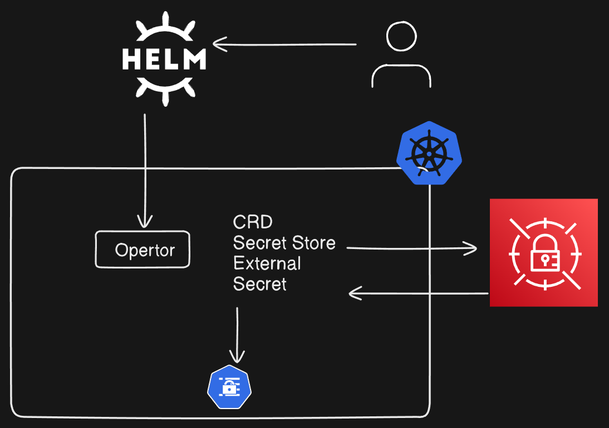

# External Secrets Operator (ESO)

Your setup process for **External Secrets Operator (ESO)** looks good, and it should work with a few adjustments to make sure everything is properly configured.

---


# Install External Secrets Operator using Helm

```bash
helm repo add external-secrets https://charts.external-secrets.io
helm install external-secrets external-secrets/external-secrets -n external-secrets --create-namespace 

```
---

# Create a Secret Containing Your AWS Credentials
```bash
kubectl create secret generic awssm-secret --from-literal=access-key=enter_the_access_key  --from-literal=secret-access-key=enter_the_secret_access_key
```

---
# Create a Secret Store for AWS Credentials


```yaml
apiVersion: external-secrets.io/v1beta1
kind: SecretStore
metadata:
  name: awssm-secret
spec:
  provider:
    aws:
      service: SecretsManager
      region: ap-south-1
      auth:
        secretRef:
          accessKeyIDSecretRef:
            name: awssm-secret
            key: access-key
          secretAccessKeySecretRef:
            name: awssm-secret
            key: secret-access-key

```

Apply the configuration:

```bash
kubectl apply -f Secretstore.yaml
```
---
# Create External Secret to Fetch Secret from AWS Secrets Manager

```yaml
apiVersion: external-secrets.io/v1beta1
kind: ExternalSecret
metadata:
  name: demo
spec:
  refreshInterval: 10m
  secretStoreRef:
    name: awssm-secret
    kind: SecretStore
  target:
    name: kube-secret
    creationPolicy: Owner
  dataFrom:
    - extract:
        key: name-of-secrets-in-secrets-manager
      
```


```bash 
kubectl apply -f External-secret.yaml
```
---

# Verify the Secrets in Kubernetes

```bash
kubectl get secret kube-secret -o yaml
```

# mouth the secrets in the pod

```yaml
apiVersion: v1
kind: Pod
metadata:
  name: demo-pod
  namespace: default
spec:
  containers:
    - name: demo-container
      image: nginx
      volumeMounts:
        - name: secret-volume
          mountPath: "/etc/secrets"
          readOnly: true
  volumes:
    - name: secret-volume
      secret:
        secretName: kube-secret
```
   
```bash
kubectl apply -f pod.yaml

```

# verify the mouth 
```bash
kubectl exec -it demo-pod -- cat etc/secrets/name-of-secrets-in-secrets-manager
```

## **Benefits of External Secrets Operator**

1. **Dynamic Secret Management**:  
   Secrets are retrieved dynamically at runtime from external secret stores, ensuring they are always up to date.

2. **Secure Storage**:  
   Secrets are not stored directly in Git or Kubernetes manifests, reducing the risk of leakage in version control.

3. **Centralized Secret Management**:  
   Uses external tools (e.g., AWS Secrets Manager, Vault) for centralized, secure, and scalable secret management.

4. **Supports Multiple Providers**:  
   ESO integrates with various providers like AWS, GCP, Azure, and others, offering flexibility for multi-cloud environments.

5. **Automatic Syncing**:  
   Changes in external secret stores are automatically synced to Kubernetes secrets at configurable intervals (e.g., `refreshInterval`).

6. **Fine-Grained Access Control**:  
   Leverages IAM roles, service accounts, and provider-specific policies to control access to secrets.

7. **Environment Agnostic**:  
   Keeps secrets provider-specific, avoiding hardcoding or cluster-specific configurations.

8. **Open Source and Extensible**:  
   As an open-source solution, ESO benefits from community contributions and supports custom configurations.

---

## **Limitations of External Secrets Operator**

1. **Dependency on External Providers**:  
   Requires an operational and accessible external secrets manager. Outages or connectivity issues can impact Kubernetes workloads.

2. **Complex Setup**:  
   Initial configuration, including provider authentication, roles, and policies, can be more complex than native Kubernetes secrets.

3. **Provider Lock-In**:  
   Integrations with external secret managers may lead to dependency on specific cloud services.

4. **Access Latency**:  
   Fetching secrets dynamically may introduce slight delays, especially if the provider has high latency.

5. **Additional Costs**:  
   Using cloud-based secret stores like AWS Secrets Manager or HashiCorp Vault may incur additional charges.

6. **Limited Offline Availability**:  
   Secrets are fetched from external systems; if the system is unavailable, ESO might fail to retrieve or sync them.

7. **Compatibility Challenges**:  
   Not all external providers are supported natively, and new integrations may require custom implementation.
